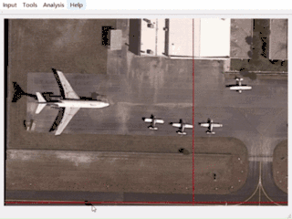
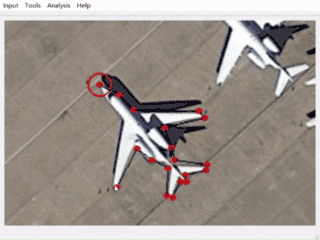
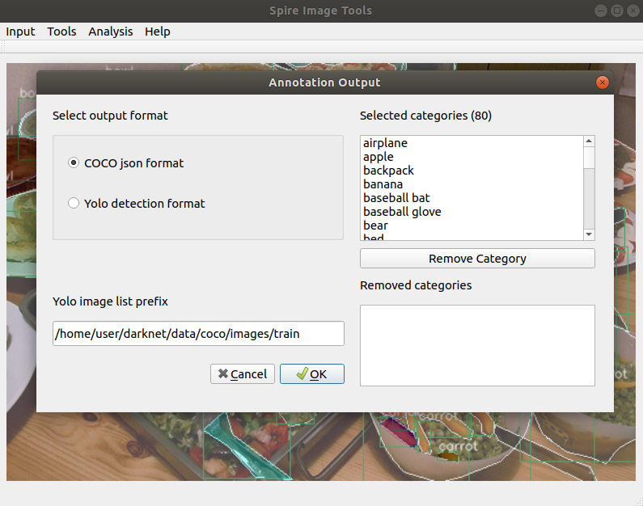
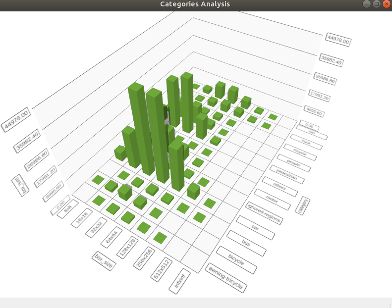

# Spire Image Manager
Another toolset for image data annotation, preprocessing, visualization.

The labeling and visualization tools V4.4.8 (Windows x64) can be download on [**Spire Web addr1**](http://jario.ren/upload/ImageLabelTools-4.4.8.zip) OR [**Spire Web addr2**](http://8.210.26.89/upload/ImageLabelTools-4.4.8.zip).

## How to use


Support a variety of annotations.

<tr>
<td></td>
<td></td>
</tr>

## Evaluation of spire annotations
see [EVALUATION_README.md](utils/evaluate/README.md)

## One json corresponds to an image
```bash
{
	"annos": [{
		"area": 277,
		"bbox": [552, 251, 24, 17],
		"category_name": "car",
		"segmentation": [[561, 253, 552, 263, 558, 266, 564, 268, 573, 266, 576, 260, 576, 254, 572, 251]]
	}],
	"file_name": "000009.jpg",
	"height": 720,
	"width": 1280
}
```

## Conversion between spire and MS COCO format
Convert MS COCO annotations to spire annotations.
```bash
python to-spire-annotation/coco_to_spire.py --coco-anno path_to_coco_json --coco-image-dir path_to_coco_image_dir --output-dir spire_annotation_dir
```

Convert spire annotations to MS COCO annotations.


## Data statistics


